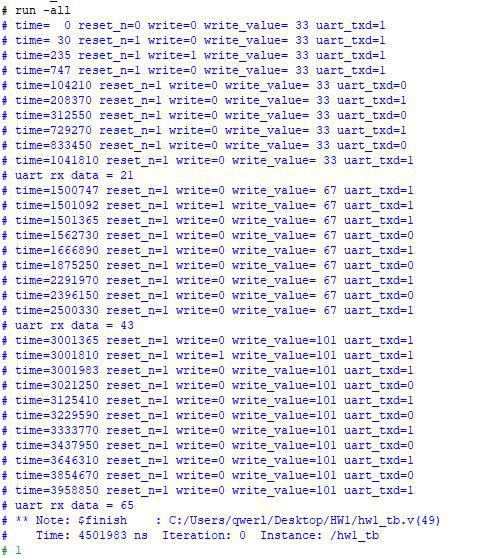
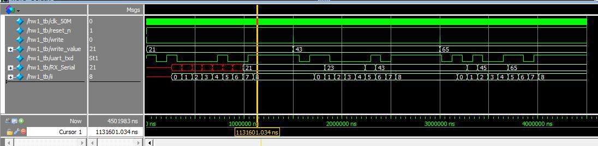

# UART_TX
 This project is made by Quartus Lite

- ## Goal
    - Creating a UART TX with some properties below:
      1. BaudRate : 9600
      2. Data : 8 bits
      3. None Parity
      4. 1 Stop Bit
    - When Write Pin input a negative edge, it should read write_value as TX data, and transfer the datas which are in the UART_TXD.
    - Using hw1_tb.v as Top level bench
    - It require  Synchronous Design, and it should use clk_50M or reset as clock, it can't use other signal as clock.
---
- ## Result
    - Log text
      

    - The result of waveform graph
      
